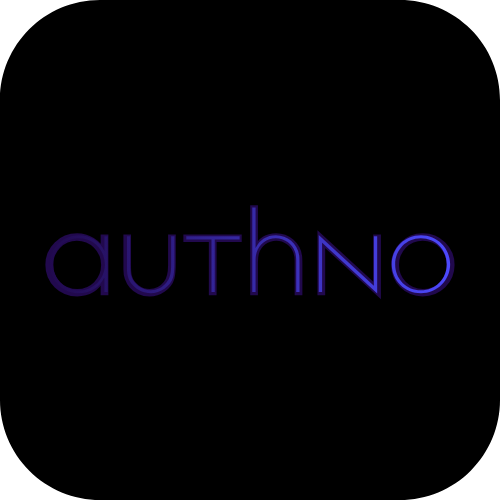
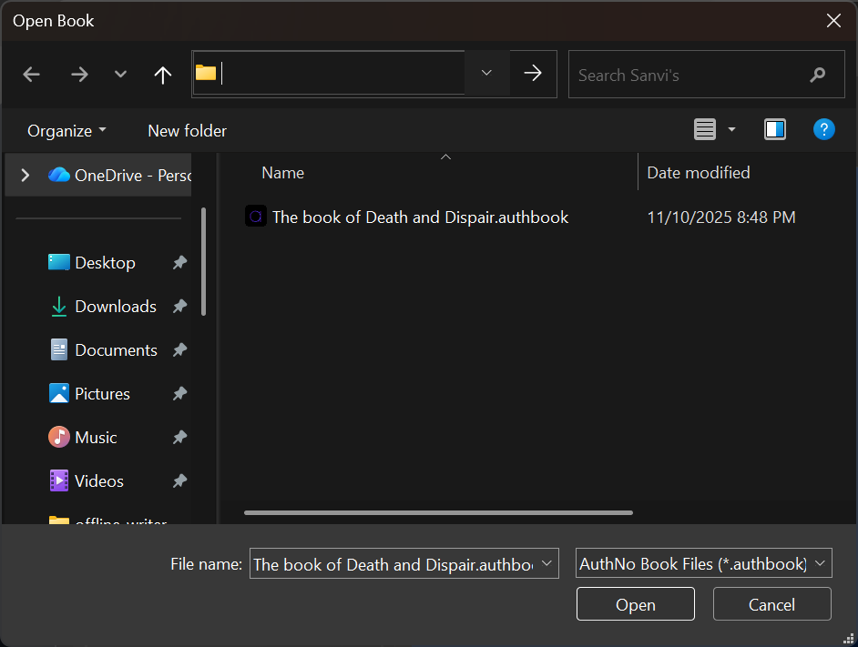
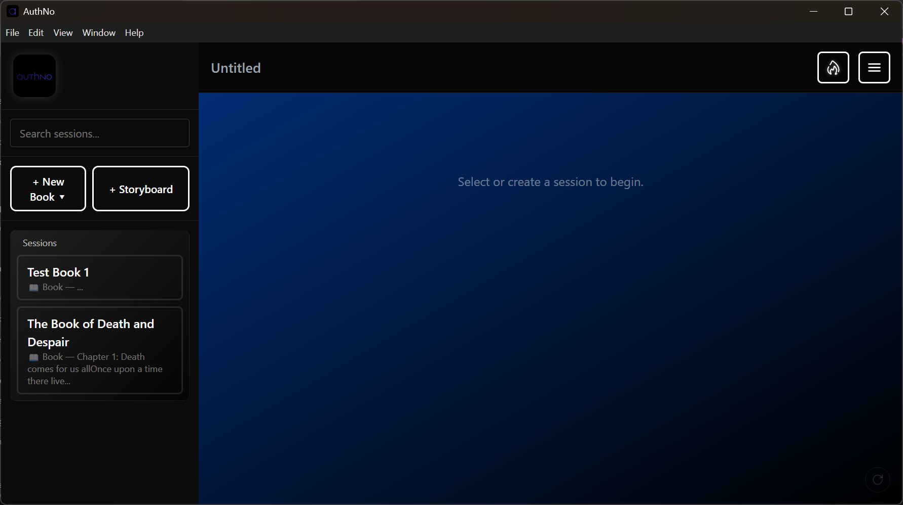
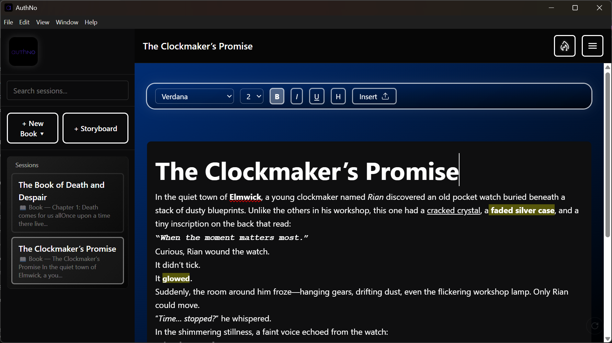

# **Authno**

*A fast, offline writing app for authors who want to focus entirely on their stories.*

<p align="center">
  
</p>

<p align="center">
  <b>Write without distractions. Everything saved locally. Cross-platform. Secure. Yours.</b>
</p>

<p align="center">
  
  <a href="LICENSE.txt">
    
  </a>
  
  
  
  
</p>
---

## **What is Authno?**
Authno is a **local-first writing tool** built specifically for **authors**, designed to let you write books, stories, drafts, and long-form text without distractions, lag, or reliance on the internet.
Every file stays on your device — no accounts, no cloud sync, no online requirements.
Authno uses a custom file format (`.authbook`) to save writing projects quickly.

---

## **Current Features**
### **Offline Support**
* Fully local.
* Uses `.authbook` project files stored on your machine.

### **Cross-Platform**
* Windows
* Linux (AppImage, DEB, RPM)

### **Basic Author Tools**
* Core writing experience
* Basic text formatting
* Simple, clean interface
* Shortcut support (e.g., **Ctrl + B** to bold)

---

## Screenshots
<p align="center">
  <a href="./public/screenshots/authno-file.png"></a>
  <a href="./public/screenshots/authno-hs.png"></a>
  <a href="./public/screenshots/authno-ss.png"></a>
</p>

**Figure 1.** Left — File manager opening a `.authbook` file. Center — Homescreen / dashboard (planned). Right — Example story showing formatting options.


---
## **Download Authno**
### **Windows**
**Installer (Recommended)**
You’ll find it directly under the latest release as:
`AuthNo-Setup-<version>.exe`

### **Linux**
| Format                  | File                          |
| ----------------------- | ----------------------------- |
| **AppImage**            | `Authno-<version>.AppImage`   |
| **DEB (Ubuntu/Debian)** | `Authno_<version>_amd64.deb`  |
| **RPM (Fedora/RedHat)** | `Authno-<version>.x86_64.rpm` |

Go to the Releases page and download whichever matches your system.
---

## **Roadmap**
Planned for upcoming versions:

### **Core Improvements**
* [ ] Add Settings menu
* [ ] Implement Storyboards properly
* [ ] Homescreen / dashboard view
* [ ] UI/UX cleanup & consistency
* [ ] Layout editing tools
* [ ] Editor feature expansion (formatting tools, search, more)

### **Future Experiments**
* [ ] Chapter management
* [ ] Writing statistics
* [ ] Daily streaks with logic
* [ ] Dark/light theme controls

---

## Known Limitations (Beta)
* Some UI/UX roughness
* Storyboard button currently behaves like "New Book"
* Editing layout menu is not implemented yet
* Streak display has no logic behind it yet

---

## Project Structure
```
/public             → app icons & logos  
/src                → React frontend  
/main.js            → Electron main process  
/preload.js         → Preload scripts  
/fileManager.js     → Local file system logic  
/dist               → Build output (ignored in repo)  
```
